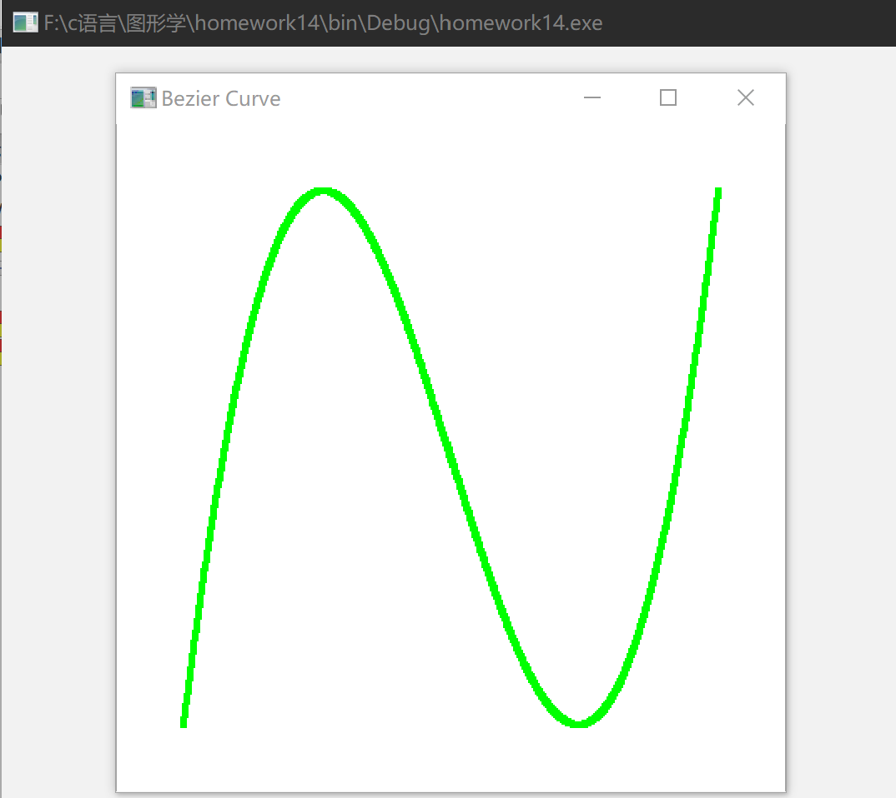

# Work_14  Bezier曲线

时间：2022年6月8日
地点：信息学院机房

## 一、实验内容

* 使用opengl，教材P323 Bezier曲线；

## 二、实验目的

* 采用Bezier函数验证曲线生成；

## 三、实验截图

## 四、实验总结及体会

* Bezier曲线是通过一组多边形折线的顶点来定义的。如果折线的顶点固定不变，则由其定义的Bezier曲线是唯一的。在折线的各顶点中，只有第一点和最后一点在曲线上且作为曲线的起始处和终止处，其他的点用于控制曲线的形状及阶次。曲线的形状趋向于多边形折线的形状，要修改曲线，只要修改折线的各顶点就可以了。