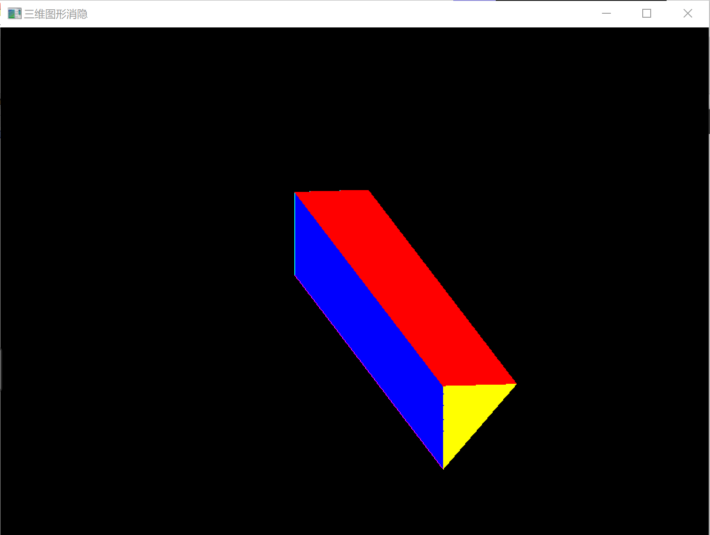

# Work_15  消隐实验

时间：2022年6月15日
地点：信息学院机房

## 一、实验内容

* 完成消隐实验，采用Z-buffer算法完成消隐

## 二、实验目的

* 熟悉Z-buffer、画家算法等相关内容；

## 三、实验截图

## 四、实验总结及体会

* 消隐：就是必须在绘制时消除被遮挡的不可见的线或面，习惯上称作消除隐藏线和隐藏面；消隐不仅与消隐对象有关还与观察者的位置有关。
* Z-buffer算法（深度缓冲器算法）基本思想：先将Z缓冲器中各单元的初始值置为最小值，当要改变某个象素的颜色值时，首先检查当前多边形的深度值是否大于该象素原来的深度值（保存在该象素所对应的Z缓冲器的单元中），如果大于原来的Z值，说明当前多边形更靠近观察点，用它的颜色替换原象素的颜色。
* 【优点】
  （1）Z-buffer算法比较简单，直观；
  （2）在象素上以近物取代远物，与物体在屏幕上的出现顺序无关，有利于硬件实现。
* 【缺点】
  （1）占用空间大；
  （2）没有利用图形的相关性与连续性；
  （3）该算法是在象素级上的消隐算法。
*  缺点改进：并不需要开辟一个与图像大小相等的深度缓存数组，只用一个深度缓存变量zb的改进算法
