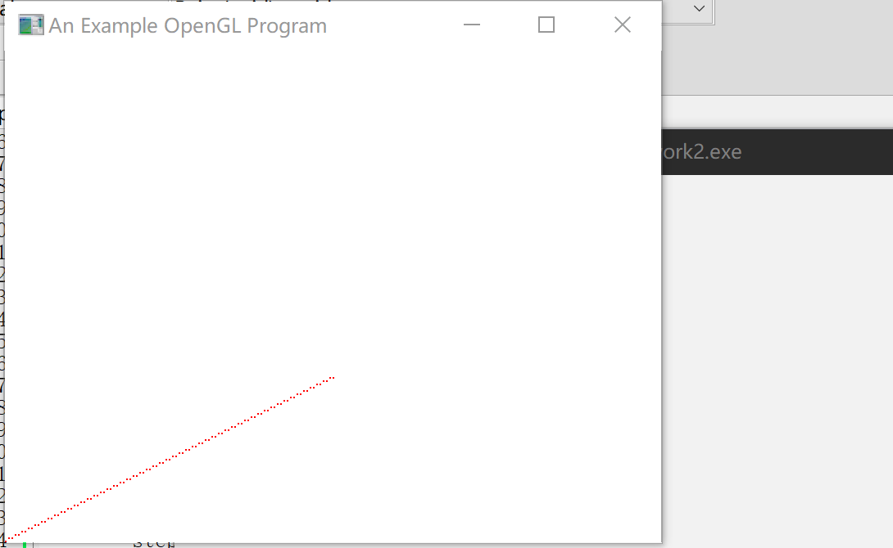

# Work_2  DDA直线生成算法

时间：2022年3月23日
地点：信息学院2202机房

## 一、实验内容

* 熟悉OPENGL，通过DDA、中点算法生成直线段

## 二、实验目的

* 安装OPENGL，能编写代码运行，参考课本代码

## 三、实验截图

## 四、实验总结及体会

* DDA算法计算像素位置比直接使用直线方程计算的速度更快一些，但取整误差的累积可能会使所计算的像素位置偏离实际线段，且取整操作和浮点运算耗费也较多时间；
* GLUT内包含的函数较多，应尽快熟悉GLUT的各种函数，以便于更熟练的画出所需图形；