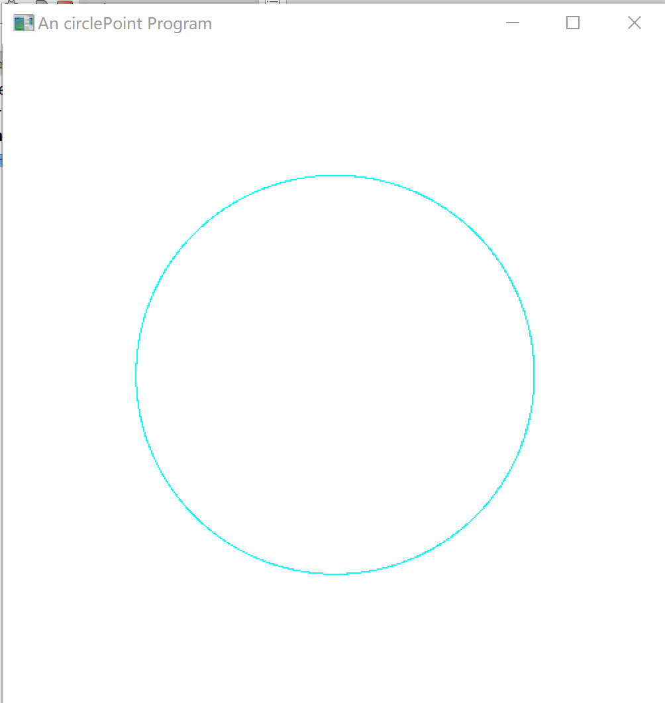
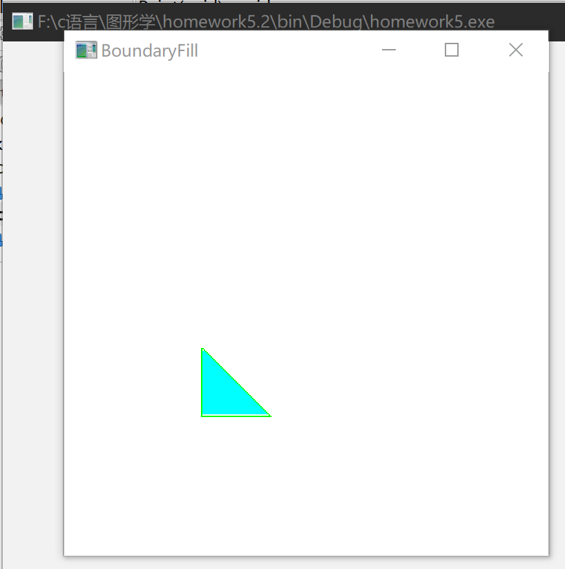

# Work_5  填充算法实验

时间：2022年4月13日
地点：信息学院2202机房

## 一、实验内容

* 圆扫描转换
* 种子点填充算法

## 二、实验目的

* 输入圆的半径，画出圆
* 输入多边形，种子点位置，填充多边形

## 三、实验截图

## 四、实验总结及体会

* 该算法的目标是找到一个通过使用像素网格的使得每个像素点尽可能接近x ^ 2 + y ^ 2 = r ^ 2的路径。
* 种子填充算法的基本思想是从多边形区域的一个内点开始，由内向外用给定的颜色画点直到边界为止。如果边界是以一种颜色指定的，则种子填充算法可逐个像素地处理直到遇到边界颜色为止。种子填充算法常用四连通域和八连通域技术进行填充操作。