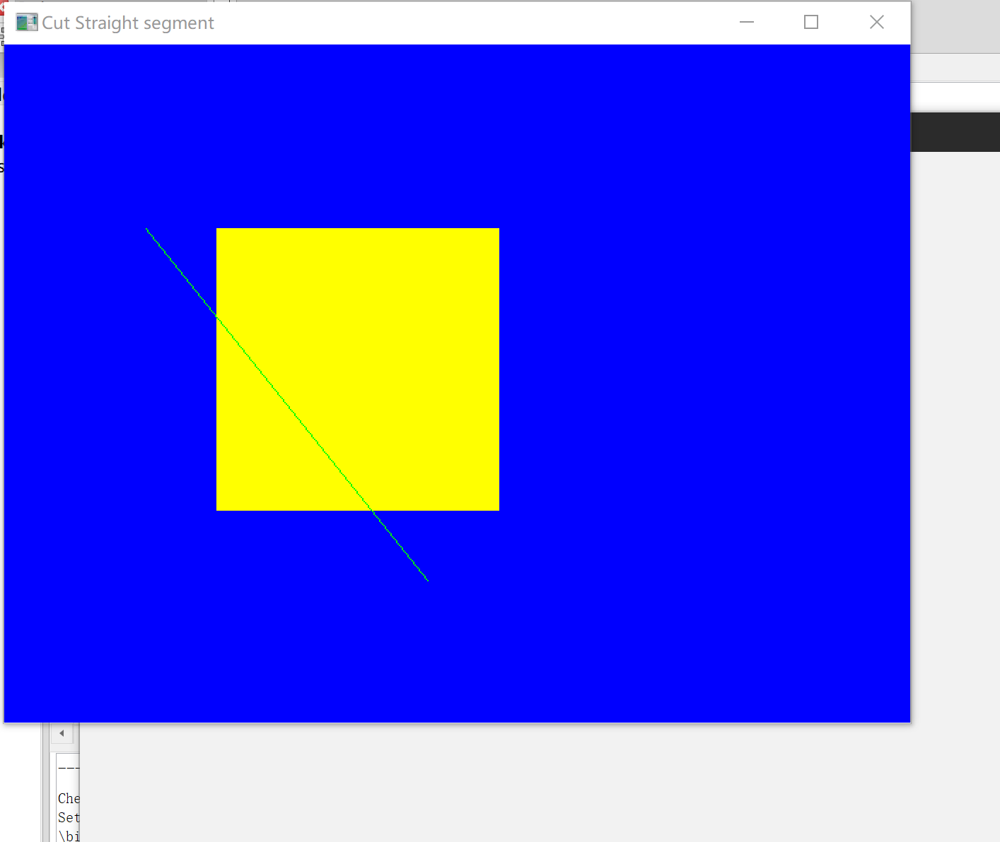
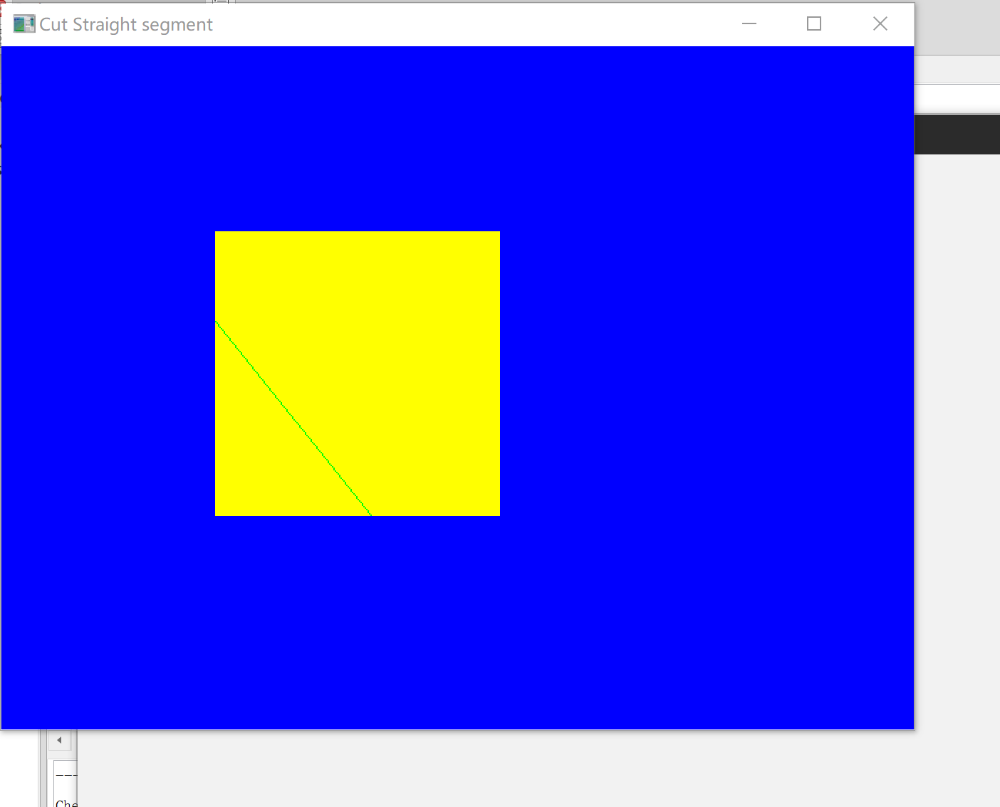

# Work_8  二维图像裁剪实验

时间：2022年5月4日
地点：信息学院2202机房

## 一、实验内容

* 使用opengl，用Cohen-Sutherland线段裁剪算法对直线段进行裁剪；

## 二、实验目的

* 验证Cohen-Sutherland裁剪算法，从键盘输入任意的直线段，用指定的裁剪窗口裁剪直线段；

## 三、实验截图

## 四、实验总结及体会

* 一旦给所有的线段端点建立了区域码，就可以快速的判断哪条线段完全在裁剪窗口之内，哪条线段完全在窗口之外：①线段完全在窗口之内：线段的两个端点的区域码均为0000，保留这样的线段。②线段完全在窗口之外：线段的两个端点的区域码中有一对相同的位置都为1，丢弃这样的线段。程序中对线段在窗口内部还是外部的判断是对两个端点的区域码进行逻辑或操作。如果操作结果为0000，则线段完全位于裁剪窗口之内，保留此线段并测试下一条线段。若两个端点的区域码进行逻辑与操作结果为真（不是0000），则表明线段完全位于窗口之外，丢弃此线段。③对于不能判断为完全在窗口外或窗口内的线段，则要测试其与窗口边界的交点。
* 这些线段可能穿过或不穿过窗口内部。因此可能要进行多次求交运算才可完成一条线段的裁剪，求交次数依赖于选择裁剪边界的次序。每次处理一条裁剪窗口边界之后，裁剪掉其中的一部分，余下的部分对照窗口的其他边界进行检查。该过程一直进行到线段完全被裁剪掉或余下的线段部分完全在裁剪窗口内。
* 本算法的优点在于简单且易于实现。用编码方法可快速判断线段的完全可见和不可见，可以简单的描述为将直线在窗口左边的部分删去，按左，右，下，上的顺序依次进行，处理之后，剩余部分就是可见的了。在这个算法中求交点的操作比较重要，他决定了算法的速度。适用二种情形：大窗口场合；窗口特别小场合。