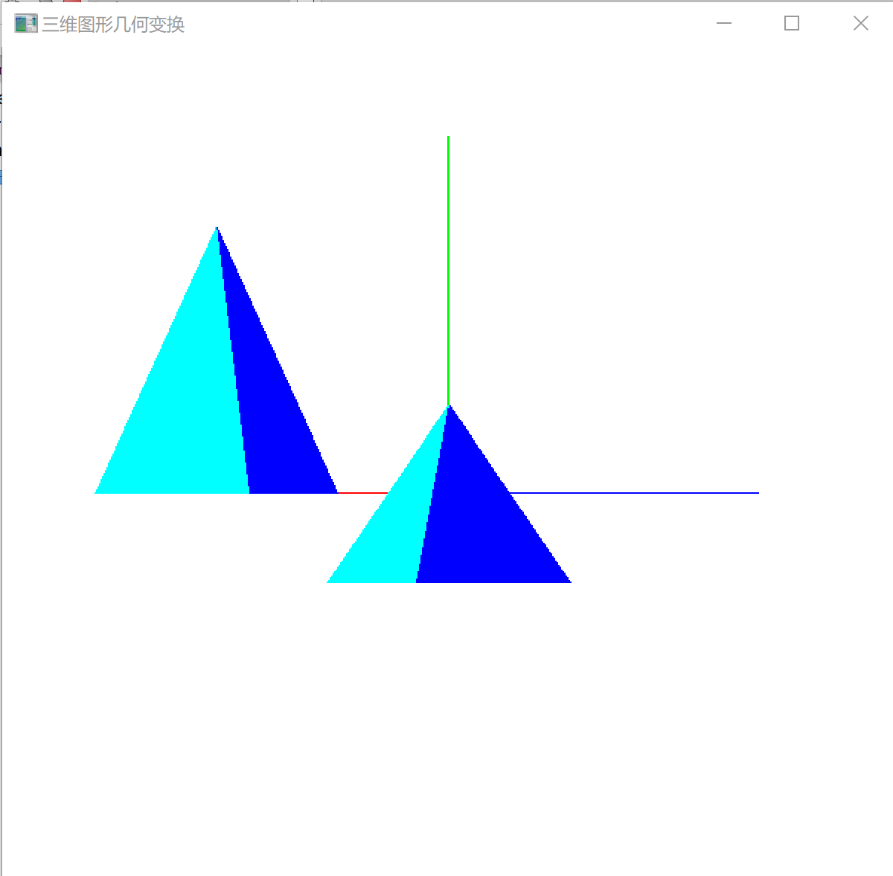

# Work_9  三维图形几何变换实验

时间：2022年5月11日
地点：信息学院2202机房

## 一、实验内容

* 教材p222，三维图形旋转、缩放变换、平移变换、错切变换、对称变换等任意变换；

## 二、实验目的

* 调用函数完成三维图形几何变换；

## 三、实验截图

## 四、实验总结及体会

* 三维图形变换分为：几何变换和投影变换。
    基本几何变换都是相对于坐标原点、坐标轴和坐标平面，包括：平移、缩放、旋转、对称和错切。
    三维空间中点的变换可以表示成点的齐次坐标与四阶的变换矩阵相乘。
