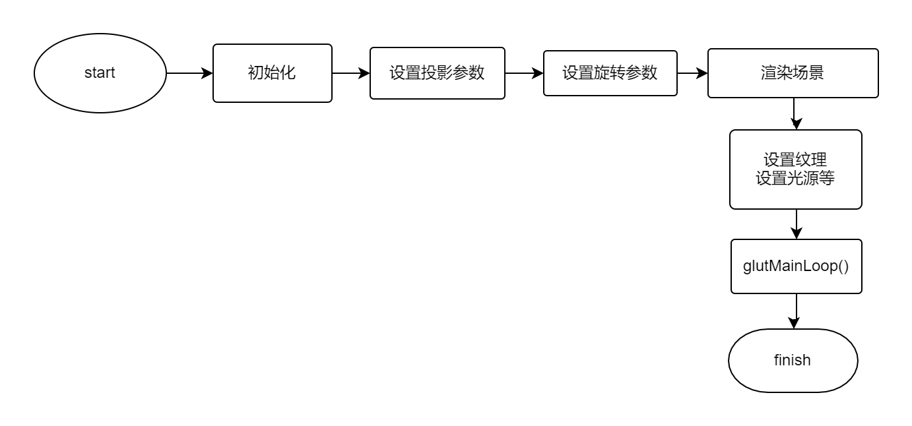
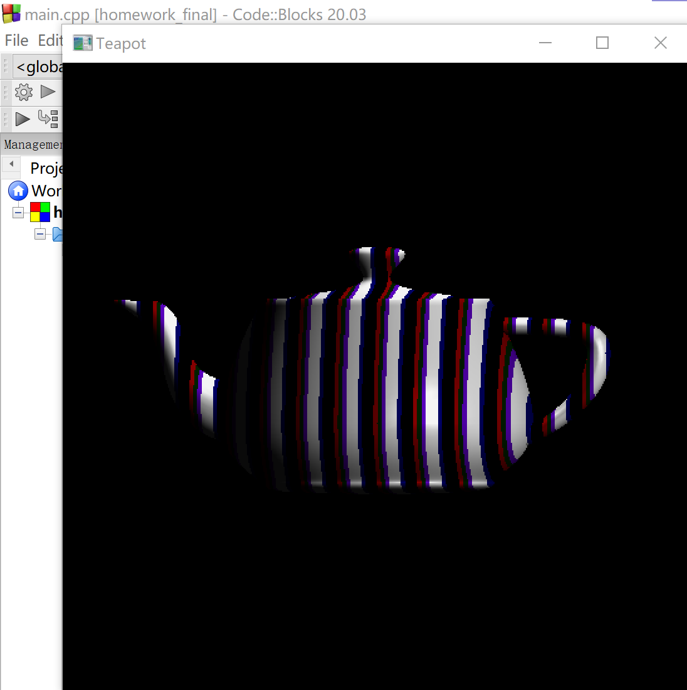
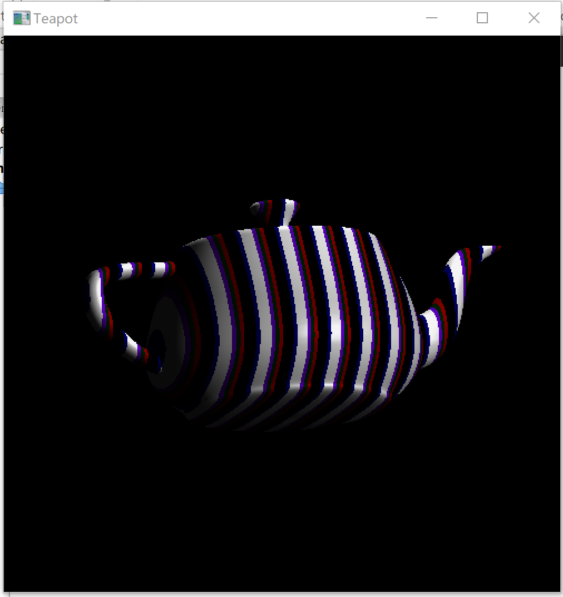
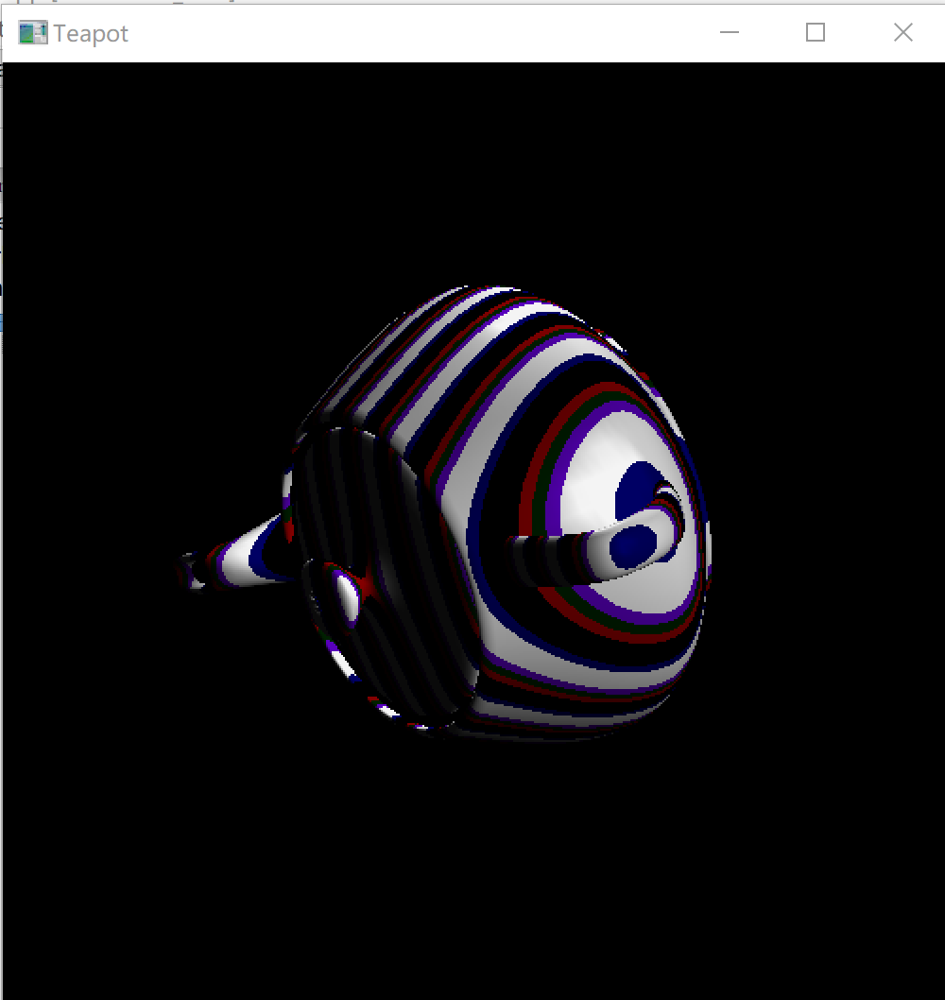
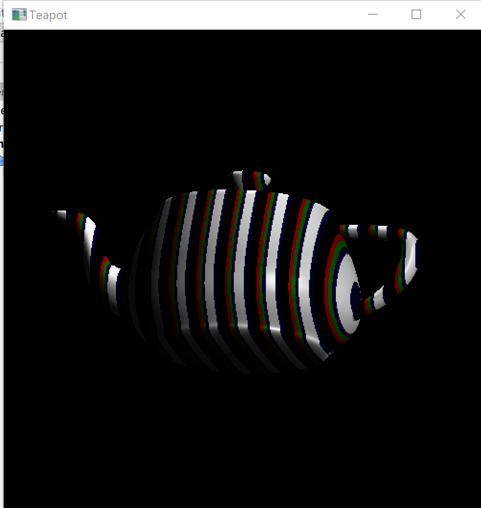
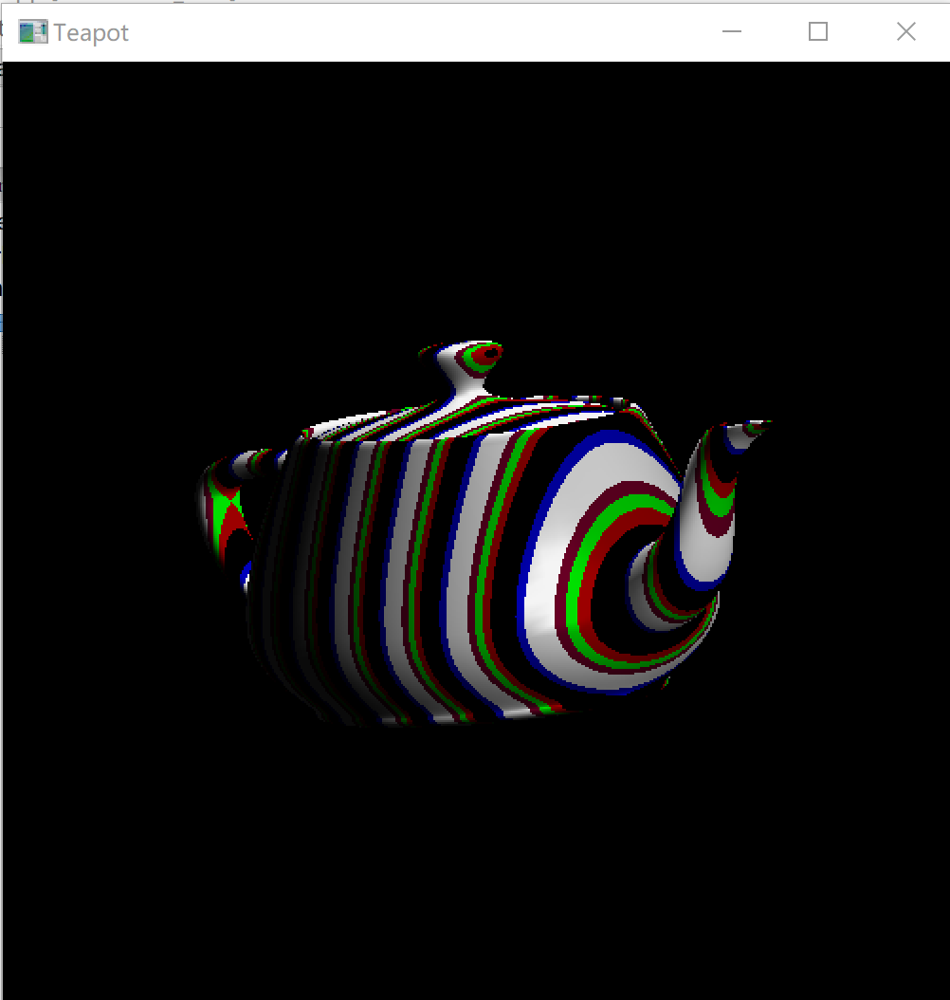
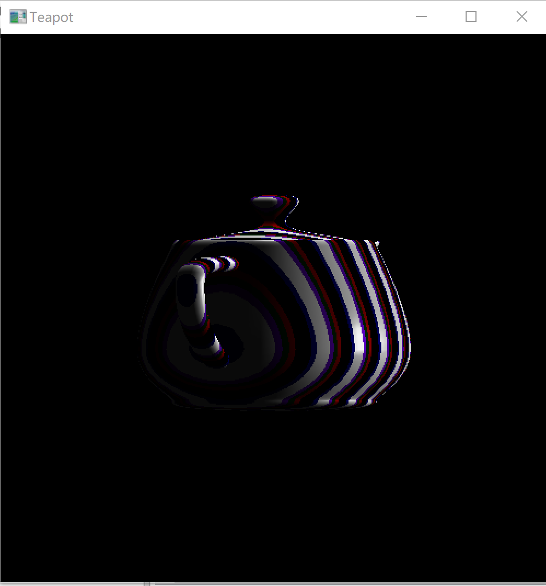
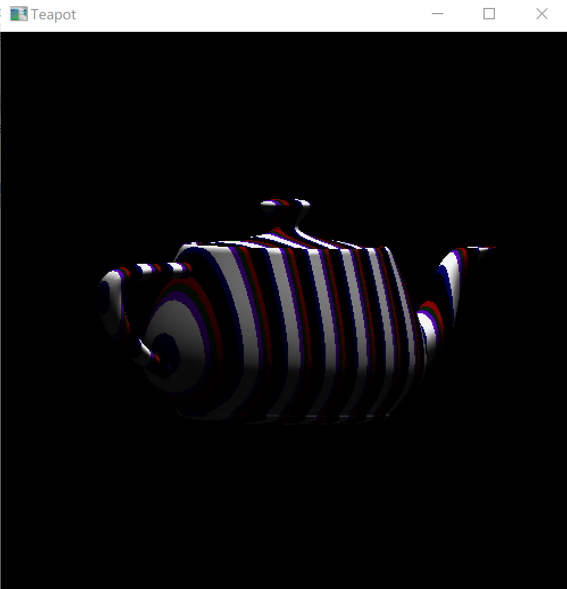

# Work_final  期末大作业

### 题目：三维茶壶旋转及渲染操作的实现
### 学号：20201060338
### 姓名：朱硕
### 指导老师：钱文华
### 日期：2022年6月15日
### 中文摘要
 - 利用OpenGL等工具可实现三维图形渲染，自定义三维图形，渲染的过程加入纹理、色彩、光照等效果。本次实验选择了绘制三维茶壶并在其基础上加入光照，纹理等元素，可通过键盘的上、下、左、右键控制茶壶的旋转方向与旋转速度，使绘制的三维茶壶保持动态效果，使其更逼真、视觉效果更加突出；
### 关键词
 - 图形绘制；旋转操作；纹理映射；光照处理；
### 目录
  #### 一、实验背景与实验内容
  - 1．实验背景
  - 2．实验内容
  #### 二、实验相关介绍
  - 1．实验开发工具
  - 2．程序设计及实现目的
  - 3．基本模块介绍
  #### 三、关键算法介绍及程序实现步骤
  #### 四、实验结果
  - 1．实验截图
  - 2．分析结果及存在问题
  - 3．实验体会与小节
  #### 五、参考文献
  #### 六、附录

## 一、实验背景与实验内容
### 1．实验背景
绘制三维图形时，时常出现绘制效果真实度低、视觉效果差等问题，因而我们不能仅简单地调用三维图形的绘制函数进行相关图形的绘制，而应更多的加入一些纹理、色彩、光照、阴影等效果，使所绘制图形的视觉效果更佳、更真实。
### 2．实验内容
利用Visual C++, OpenGL, Java等工具，实现三维图形渲染，自定义三维图形，三维图形不能仅仅是简单的茶壶、球体、圆柱体、圆锥体等图形，渲染过程须加入纹理、色彩、光照、阴影、透明等效果，可采用光线跟踪、光照明模型、纹理贴图、纹理映射等算法。
## 二、实验相关介绍
### 1．实验开发工具：
Visual C++, OpenGL, Java等工具；
### 2．程序设计及实现目的：
在绘制三维图形的过程中设计加入纹理、色彩、光照等立体效果的程序，以达到增强所绘制图形真实度、改善视觉效果的目的；
### 3．基本模块介绍
- 1).绘制基本三维图形——茶壶；
- 2).加入色彩、纹理、光照等效果；
- 3).增加旋转参数，可使用键盘进行旋转控制；
- 4).设置投影参数，进行正交投影；
## 三、实验关键算法介绍
    void Texture(void)//纹理设置
    {
    int j = 0;
    for (j = 0; j < 10; j++)
    {
        stripeImage[1*j+2] = 1000;
        stripeImage[2*j] = 100 * j;
        stripeImage[1*j+2] = 500;
    }
    }

    void  Projection(GLsizei w,GLsizei h)//投影
    {
    glViewport (0, 0, (GLsizei) w, (GLsizei) h);//投影参数
    glMatrixMode (GL_PROJECTION);
    glLoadIdentity();//进行正交投影
    if (w <= h)
        glOrtho (-100.0, 100, -100.0*(GLfloat)h/(GLfloat)w,
                 100.0*(GLfloat)h/(GLfloat)w, -1000.0, 1000.0);
    else
        glOrtho (-100.0*(GLfloat)w/(GLfloat)h,
                 //设置模型参数--几何体参数
                 100.0*(GLfloat)w/(GLfloat)h, -100.0, 100.0, -1000.0, 1000.0);
    glMatrixMode(GL_MODELVIEW);
    glLoadIdentity();
    }
    //设置渲染环境，预加载纹理等
    void Set(void)//设置渲染环境，预加载纹理等
    {
    GLfloat mat_specular[] = { 1.0, 1.0, 1.0, 1.0 };
    GLfloat mat_shininess[] = { 100.0 };
    GLfloat light_position[] = { 400.0, 100.0, 500.0, 0.0};//光源的位置
    GLfloat light_ambient[]= {0.0, 0.0, 0.0, 1.0}; //光环境
    GLfloat light_diffuse[]= { 1.0, 1.0, 1.0, 1.0 }; //散射光
    GLfloat light_specular[]= { 1.0, 1.0, 1.0, 1.0 }; //镜面光
    GLfloat light_position1[] = { 0.0, 100.0, 0.0, 1.0 };
    glClearColor (0.0, 0.0, 0.0, 0.0);
    glShadeModel (GL_SMOOTH);
    Texture();//调用纹理设置函数
    glPixelStorei(GL_UNPACK_ALIGNMENT, 1);
    glTexEnvf(GL_TEXTURE_ENV, GL_TEXTURE_ENV_MODE, GL_MODULATE);
    glTexParameterf(GL_TEXTURE_1D, GL_TEXTURE_WRAP_S, GL_REPEAT);
    glTexParameterf(GL_TEXTURE_1D, GL_TEXTURE_MAG_FILTER, GL_NEAREST);
    glTexParameterf(GL_TEXTURE_1D, GL_TEXTURE_MIN_FILTER, GL_NEAREST);
    //纹理映射
    glTexImage1D(GL_TEXTURE_1D, 0, 3, 10, 0, GL_RGB, GL_UNSIGNED_BYTE, stripeImage);
    glTexGeni(GL_S, GL_TEXTURE_GEN_MODE, GL_OBJECT_LINEAR);
    glTexGenfv(GL_S, GL_OBJECT_PLANE, sgenparams);
    glEnable(GL_DEPTH_TEST);
    glDepthFunc(GL_LESS);
    glEnable(GL_TEXTURE_GEN_S);
    glEnable(GL_TEXTURE_1D);
    glEnable(GL_CULL_FACE);
    glEnable(GL_LIGHTING);
    glEnable(GL_LIGHT0);
    glEnable(GL_AUTO_NORMAL);
    glEnable(GL_NORMALIZE);
    glFrontFace(GL_CW);
    glCullFace(GL_BACK);//设置材质
    glMaterialf (GL_FRONT, GL_SHININESS, 100.0);
    glMaterialfv(GL_FRONT, GL_SPECULAR, mat_specular);
    glMaterialfv(GL_FRONT, GL_SHININESS, mat_shininess);
    glEnable(GL_LIGHTING);//启用光照

    //远光源照射
    glLightfv(GL_LIGHT0, GL_POSITION, light_position);
    glLightfv(GL_LIGHT0, GL_AMBIENT, light_ambient);
    glLightfv(GL_LIGHT0, GL_DIFFUSE, light_diffuse);
    glLightfv(GL_LIGHT0, GL_SPECULAR, light_specular);
    glEnable(GL_LIGHT0);
    glLightfv(GL_LIGHT1, GL_POSITION, light_position1);
    glLightfv(GL_LIGHT1, GL_AMBIENT, light_ambient);
    glLightfv(GL_LIGHT1, GL_DIFFUSE, light_diffuse);
    glLightfv(GL_LIGHT1, GL_SPECULAR, light_specular);
    glEnable(GL_LIGHT1);
    glEnable(GL_DEPTH_TEST);
    }
程序实现步骤如下图所示：
  
## 四、实验结果
### 1.实验截图
茶壶图像如下:  
  
旋转中的茶壶图像如下：
  
  
更改纹理参数后的茶壶图像如下：
  
  
更改光源位置后的茶壶图像如下：
  
  

### 2.分析结果及存在问题
- 实验结果：实验绘制了三维图形——茶壶，并成功加入了纹理、光照等效果，实现了立体、真实的三维效果；此外，可通过纹理参数的修改更改三维图形的颜色与纹理效果、可通过光源位置的改变实现光照投影的改变、可通过键盘控制茶壶旋转的方向与速度；
- 存在问题：在键盘控制茶壶旋转的过程中，旋转方向存在局限性，仅可以实现上、下方向的改变，并不能实现任意方向的改变；此外，在采用键盘控制茶壶进行逆时针旋转时，速度控制效果不佳。
### 3．实验体会与小结
- 通过本次的计算机图形学综合实验，我更加熟悉了基础图形的绘制，可以利用所学知识绘制基本、简单的二维、三维图形；
- 深入了解到很多图形绘制算法，比如添加纹理、光照等绘制效果，这些效果的加入将会使绘制的图形更加真实、生动，可以使图形的展示不再局限于普通的二维效果；
- 在实现各种效果的过程中我遇到了很多问题，大多数问题都是由于对OpenGL的各类函数不熟悉，通过不断上网查阅资料、查阅文献、询问老师同学，我对于各类函数的调用更加熟悉、也掌握了各类图形绘制的算法；
- 本次实验仍存在一定的问题，在键盘控制图形旋转方面有很大的进步空间，虽本次实验未能完全解决存在的问题，但我会在结课后继续深入研究、思考问题的解决方法，继续学习计算机图形学的相关内容。
## 五、参考文献
- [1] Nakhoon Baek and Kuinam J. Kim. Design and implementation of OpenGL SC 2.0 rendering pipeline[J]. Cluster Computing, 2019, 22(1) : 931-936.
- [2] Jin Xu and Xun Chen. Study and Analysis Texture Mapping Technology Based on OpenGL[J]. Applied Mechanics and Materials, 2012, 2034(229-231) : 1990-1993.
- [3] Dženan Avdić et al. Real-time shadows in OpenGL caused by the presence of multiple light sources[J]. Tehnički vjesnik, 2017,
- [4] 陈应松,胡汉春,肖世德.基于OpenGL纹理映射技术实现动态图像的应用[J].计算机仿真,2004(05):130-132+48.
- [5] Gordon V Scott and Clevenger John L. Computer Graphics Programming in OpenGL with C++[M]. Mercury Learning & Information, 2018
- [6] 何国林,王林旭,崔雪峰,王明印. OpenGL纹理映射技术在三维图形逼真绘制中的应用研究[C]//.全国第20届计算机技术与应用学术会议(CACIS·2009)暨全国第1届安全关键技术与应用学术会议论文集（下册）.,2009:76-79.
- [7] 王玉华,杨克俭,王玲.基于OpenGL的光照处理技术绘制真实感图形[J].现代计算机(专业版),2002(09):72-75.
## 六、附录
源代码如下：

    #include <windows.h>
    #include <GL/glut.h>
    #include<math.h>
    #include <stdio.h>
    #include <stdlib.h>

    static GLfloat xrot = 0.0f;
    static GLfloat yrot = 0.0f;
    GLubyte stripeImage[30];//图像数据
    GLfloat sgenparams[] = {2.0, 0.0, 0.0, 0.0};

    void Texture(void)//纹理设置
    {
    int j = 0;
    for (j = 0; j < 10; j++)
    {
        stripeImage[1*j+2] = 1000;
        stripeImage[2*j] = 100 * j;
        stripeImage[1*j+2] = 500;
    }
    }

    void  RenderScene(void)//渲染场景
    {
    glClear(GL_COLOR_BUFFER_BIT|GL_DEPTH_BUFFER_BIT);
    glEnable(GL_CULL_FACE);
    glEnable(GL_DEPTH_TEST);
    glPolygonMode(GL_BACK,GL_FILL);
    glLoadIdentity();
    glPushMatrix();
    glColor3f(1.0,1.0,1.0);
    glRotatef(xrot, 0.0f, 0.1f, 0.0f);
    xrot+=0.1f;
    glRotatef(yrot, 0.1f, 0.0f, 0.0f);
    glutSolidTeapot(50);
    glTranslatef(150,0,0);
    glRotatef(xrot, 0.0f, 0.1f, 0.0f);
    xrot+=0.1f;
    glRotatef(yrot, 0.1f, 0.0f, 0.0f);
    glPopMatrix();
    glutPostRedisplay();
    glutSwapBuffers();
    }

    void  Projection(GLsizei w,GLsizei h)//投影
    {
    glViewport (0, 0, (GLsizei) w, (GLsizei) h);//投影参数
    glMatrixMode (GL_PROJECTION);
    glLoadIdentity();//进行正交投影
    if (w <= h)
        glOrtho (-100.0, 100, -100.0*(GLfloat)h/(GLfloat)w,
                 100.0*(GLfloat)h/(GLfloat)w, -1000.0, 1000.0);
    else
        glOrtho (-100.0*(GLfloat)w/(GLfloat)h,
                 //设置模型参数--几何体参数
                 100.0*(GLfloat)w/(GLfloat)h, -100.0, 100.0, -1000.0, 1000.0);
    glMatrixMode(GL_MODELVIEW);
    glLoadIdentity();
    }

    void Set(void)//
    {
    GLfloat mat_specular[] = { 1.0, 1.0, 1.0, 1.0 };
    GLfloat mat_shininess[] = { 100.0 };
    GLfloat light_position[] = { 400.0, 100.0, 500.0, 0.0};//设置光源位置
    GLfloat light_ambient[]= {0.0, 0.0, 0.0, 1.0}; //光环境
    GLfloat light_diffuse[]= { 1.0, 1.0, 1.0, 1.0 }; //散射光
    GLfloat light_specular[]= { 1.0, 1.0, 1.0, 1.0 }; //镜面光
    GLfloat light_position1[] = { 0.0, 100.0, 0.0, 1.0 };
    glClearColor (0.0, 0.0, 0.0, 0.0);
    glShadeModel (GL_SMOOTH);
    Texture();//调用纹理设置函数
    glPixelStorei(GL_UNPACK_ALIGNMENT, 1);
    glTexEnvf(GL_TEXTURE_ENV, GL_TEXTURE_ENV_MODE, GL_MODULATE);
    glTexParameterf(GL_TEXTURE_1D, GL_TEXTURE_WRAP_S, GL_REPEAT);
    glTexParameterf(GL_TEXTURE_1D, GL_TEXTURE_MAG_FILTER, GL_NEAREST);
    glTexParameterf(GL_TEXTURE_1D, GL_TEXTURE_MIN_FILTER, GL_NEAREST);
    //纹理映射
    glTexImage1D(GL_TEXTURE_1D, 0, 3, 10, 0, GL_RGB, GL_UNSIGNED_BYTE, stripeImage);
    glTexGeni(GL_S, GL_TEXTURE_GEN_MODE, GL_OBJECT_LINEAR);
    glTexGenfv(GL_S, GL_OBJECT_PLANE, sgenparams);
    glEnable(GL_DEPTH_TEST);
    glDepthFunc(GL_LESS);
    glEnable(GL_TEXTURE_GEN_S);
    glEnable(GL_TEXTURE_1D);
    glEnable(GL_CULL_FACE);
    glEnable(GL_LIGHTING);
    glEnable(GL_LIGHT0);
    glEnable(GL_AUTO_NORMAL);
    glEnable(GL_NORMALIZE);
    glFrontFace(GL_CW);
    glCullFace(GL_BACK);//设置材质
    glMaterialf (GL_FRONT, GL_SHININESS, 100.0);
    glMaterialfv(GL_FRONT, GL_SPECULAR, mat_specular);
    glMaterialfv(GL_FRONT, GL_SHININESS, mat_shininess);
    glEnable(GL_LIGHTING);//启用光照

    //远光源照射
    glLightfv(GL_LIGHT0, GL_POSITION, light_position);
    glLightfv(GL_LIGHT0, GL_AMBIENT, light_ambient);
    glLightfv(GL_LIGHT0, GL_DIFFUSE, light_diffuse);
    glLightfv(GL_LIGHT0, GL_SPECULAR, light_specular);
    glEnable(GL_LIGHT0);
    glLightfv(GL_LIGHT1, GL_POSITION, light_position1);
    glLightfv(GL_LIGHT1, GL_AMBIENT, light_ambient);
    glLightfv(GL_LIGHT1, GL_DIFFUSE, light_diffuse);
    glLightfv(GL_LIGHT1, GL_SPECULAR, light_specular);
    glEnable(GL_LIGHT1);
    glEnable(GL_DEPTH_TEST);
    }

    void Spin(int key, int x, int y)//旋转参数
    {
    if(key == GLUT_KEY_UP)
        yrot -= 2.0f;
    if(key == GLUT_KEY_DOWN)
        yrot += 3.0f;
    if(key == GLUT_KEY_LEFT)
        xrot -= 2.0f;
    if(key == GLUT_KEY_RIGHT)
        xrot += 3.0f;
    }

    int main(void)
    {
    glutInitDisplayMode(GLUT_DOUBLE|GLUT_RGB | GLUT_DEPTH);
    glutInitWindowSize(500,500);
    glutInitWindowPosition(50,50);
    glutCreateWindow("Teapot");
    glutReshapeFunc(Projection);
    glutSpecialFunc(Spin);
    glutDisplayFunc(RenderScene);
    Set();
    glutMainLoop();
    }

